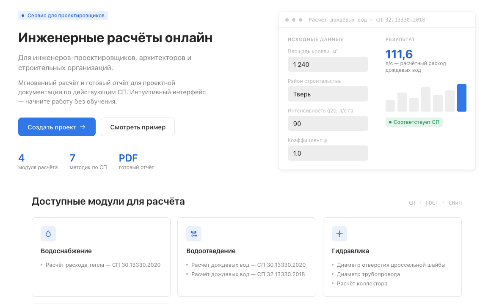

# EnTool

Веб-приложение для управления инженерными проектами и документами с встроенными инструментами инженерных расчётов: ливневый сток, ливневая кровля, теплопотребление, дроссельная заслонка.

## Tech Stack

**Frontend**


**Backend**


**Мониторинг и инфраструктура**


**Тестирование**


## Demo



## Описание проекта

EnTool — SPA-приложение для инженеров: создание и ведение проектов, работа с документами и блоками, а также интерактивные калькуляторы для типовых инженерных расчётов:

- **Ливневый сток** (rain runoff)
- **Ливневая кровля** (rain roof)
- **Теплопотребление** (heat consumption)
- **Дроссельная заслонка** (throttle plate)

Для каждого типа расчёта доступен интерактивный редактор (доска с колонками/блоками/элементами) и печатная шаблонная версия для экспорта. Формулы и подписи рендерятся в LaTeX (KaTeX). Данные и запросы к API управляются через Redux Toolkit и RTK Query, есть авторизация с автоматическим обновлением токена.

## Аутентификация

Регистрация и вход в приложение выполняются через **Яндекс OAuth** (страница `/signin`, [signin-layout.tsx](src/layouts/signin-layout/signin-layout.tsx)):

1. Пользователь нажимает «Войти с Яндекс ID» и перенаправляется на `https://oauth.yandex.ru/authorize` с `client_id` приложения.
2. После подтверждения на стороне Яндекса backend принимает authorization code, обменивает его на данные пользователя и создаёт/находит аккаунт.
3. Backend выдаёт `accessToken` (и refresh-токен), фронтенд сохраняет его в `auth`-слайсе (`auth-slice`) и подставляет в заголовок `Authorization: Bearer` для всех запросов ([base-query.ts](src/store/base-query.ts)).
4. При истечении `accessToken` (`401`) `base-query-with-reauth.ts` автоматически обращается к `auth/refresh`, обновляет токен и повторяет исходный запрос; при неудаче пользователь разлогинивается (`logout`).
5. Доступ к защищённым страницам контролируется `RedirectToLogin` (неавторизованные пользователи) и `ProtectedWrapper` (проверка ролей).

Отдельной формы регистрации логином/паролем нет — учётная запись создаётся автоматически при первом входе через Яндекс ID.

## Backend-сервисы

Frontend взаимодействует с API бэкенда (см. `VITE_API_URL`), который состоит из следующих сервисов:

- **NestJS** — REST API, бизнес-логика, авторизация
- **TypeORM** — ORM для работы с базой данных
- **PostgreSQL** — основная реляционная база данных
- **pgAdmin** — веб-интерфейс для администрирования PostgreSQL
- **Prometheus** — сбор метрик приложения и инфраструктуры
- **Grafana** — визуализация метрик и логов, дашборды
- **Loki** — агрегация и хранение логов

## Installation

```bash
# клонировать репозиторий
git clone <repository-url>
cd tools

# установить зависимости
npm install

# запустить dev-сервер
npm run dev
```

Приложение будет доступно на `http://localhost:5173`.

### Другие команды

```bash
npm run build       # проверка типов (tsc -b) и продакшн-сборка
npm run preview      # предпросмотр продакшн-сборки
npm run lint          # проверка кода ESLint
npm run lint:fix     # автоисправление ESLint
```

## Тесты

| Уровень            | Инструмент                     | Где                     |
| ------------------ | ------------------------------- | ------------------------ |
| Unit                | Vitest + Testing Library         | Frontend (компоненты, хуки, утилиты) |
| E2E                 | Cypress                          | Frontend (пользовательские сценарии) |
| Backend (unit/integration) | Jest                     | Backend (NestJS)          |

```bash
# e2e-тесты (Cypress), требуют запущенный dev-сервер на http://localhost:5173
npx cypress open
npx cypress run
npx cypress run --spec "cypress/e2e/<name>.cy.ts"   # один спецификация
```

## Пример `.env`

Создайте файл `.env` (или `.env.production` для сборки) в корне проекта:

```env
VITE_API_URL=http://localhost:3000/api/v1
VITE_TOKEN=your_token_here
```
